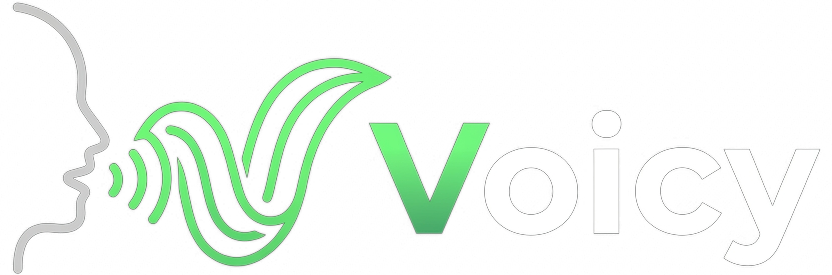

<p align="center">
  
</p>

<h1 align="center">🎙️ Voicy</h1>

<p align="center">
  <strong>Transcrição, Tradução e Síntese Vocal em Tempo Real — 100% Local</strong>
</p>

<p align="center">
  <a href="#-features">Features</a> •
  <a href="#-como-funciona">Como Funciona</a> •
  <a href="#-requisitos">Requisitos</a> •
  <a href="#-instalação">Instalação</a> •
  <a href="#-compilação">Compilação</a> •
  <a href="#-uso">Uso</a> •
  <a href="#-arquitetura">Arquitetura</a> •
  <a href="#-licença">Licença</a>
</p>

<p align="center">
  
  
  
  
</p>

---

## 📖 Sobre

**Voicy** é uma aplicação desktop de alta performance que captura áudio em tempo real, transcreve a fala, traduz o texto e reproduz a tradução vocalmente — tudo executando **localmente** na sua máquina, sem enviar nenhum dado para a nuvem.

Construído inteiramente em **Rust** com **Tauri**, o Voicy utiliza três modelos de IA de ponta:

| Etapa | Modelo | Função |
|-------|--------|--------|
| 🎤 **Transcrição** | Faster Whisper Large V3 | Converte fala em texto (Speech-to-Text) |
| 🌐 **Tradução** | TranslateGemma 4B | Traduz o texto para o idioma desejado |
| 🔊 **Síntese Vocal** | OmniVoice | Gera fala a partir do texto traduzido (Text-to-Speech) |

---

## ✨ Features

- 🚀 **Pipeline Completo em Tempo Real** — Da fala à tradução vocal em segundos
- 🖥️ **100% Local** — Nenhum dado sai da sua máquina
- ⚡ **Aceleração GPU (CUDA)** — Desempenho máximo com GPUs NVIDIA
- 🧠 **3 Modelos Simultâneos** — Todos carregados na inicialização para latência mínima
- 🎯 **Detecção Automática de Hardware** — GPU CUDA quando disponível, CPU como fallback
- 🎙️ **Múltiplos Modos** — Contínuo, Push-to-Talk, e Modo Clipboard
- 🌍 **Multi-idioma** — Suporte a dezenas de idiomas via Whisper e TranslateGemma
- 🔇 **VAD Inteligente** — Detecção de atividade vocal para segmentação automática
- ⚙️ **Configurações Persistentes** — Suas preferências salvas entre sessões
- 🎨 **Interface Moderna** — Design limpo com feedback visual em tempo real

---

## 🔄 Como Funciona

```
🎤 Microfone                    🔊 Alto-falante
     │                               ▲
     ▼                               │
┌─────────┐   ┌──────────┐   ┌──────────┐   ┌──────────┐
│  Audio   │──▶│ Whisper  │──▶│Translate │──▶│OmniVoice │
│ Capture  │   │ V3 Turbo │   │Gemma 4B  │   │   TTS    │
│  + VAD   │   │          │   │          │   │          │
│          │   │ "Olá,    │   │ "Hello,  │   │  ▶ 🔊   │
│  ~~~≋≋   │   │  mundo!" │   │  world!" │   │          │
└─────────┘   └──────────┘   └──────────┘   └──────────┘
   Áudio         Texto PT      Texto EN      Áudio EN
```

1. **Captura** — O microfone captura áudio e o VAD detecta segmentos de fala
2. **Transcrição** — Whisper V3 Turbo transcreve o áudio em texto
3. **Tradução** — TranslateGemma traduz o texto para o idioma alvo
4. **Síntese** — OmniVoice gera áudio natural a partir do texto traduzido

---

## 💻 Requisitos

### Mínimos (Modo CPU)

| Componente | Requisito |
|------------|-----------|
| **OS** | Windows 10/11 (64-bit) |
| **CPU** | 8+ cores (Intel i7 / AMD Ryzen 7 ou superior) |
| **RAM** | 16 GB |
| **Disco** | 15 GB livres (aplicação + modelos) |
| **Rust** | 1.79+ |

> ⚠️ **Aviso:** No modo CPU, o desempenho será significativamente reduzido. O programa pode não rodar de maneira adequada. **Recomendamos fortemente o uso de GPU NVIDIA.**

### Recomendados (Modo GPU)

| Componente | Requisito |
|------------|-----------|
| **GPU** | NVIDIA com 8+ GB VRAM (RTX 3070 ou superior) |
| **CUDA Toolkit** | 12.x |
| **Driver NVIDIA** | 535+ |
| **VRAM** | 10+ GB (para 3 modelos simultâneos) |

---

## 📦 Instalação

### Download Pré-compilado

1. Acesse a página de [Releases](https://github.com/mcnbr/Voicy/releases)
2. Baixe o arquivo `Voicy-vX.X.X-windows-x64.zip`
3. Extraia para uma pasta de sua escolha
4. Execute `Voicy.exe`

### Download dos Modelos

Na primeira execução, o Voicy oferecerá baixar os modelos automaticamente. Alternativamente, baixe manualmente:

```bash
# Crie a pasta de modelos
mkdir models

# Whisper Large V3 Turbo (GGUF quantizado)
# Baixe de: https://huggingface.co/oxide-lab/whisper-large-v3-turbo-GGUF

# TranslateGemma 4B (GGUF quantizado)  
# Baixe de: https://huggingface.co/google/translate-gemma-4b-it-GGUF

# OmniVoice
# Baixe de: https://huggingface.co/FerrisMind/omnivoice
```

Coloque todos os arquivos na pasta `models/` ao lado do executável.

---

## 🔨 Compilação

### Pré-requisitos

```bash
# Instale o Rust
curl --proto '=https' --tlsv1.2 -sSf https://sh.rustup.rs | sh

# Instale as dependências do Tauri (Windows)
# Necessário: Microsoft Visual Studio C++ Build Tools
# WebView2 (incluso no Windows 10/11)

# Para suporte CUDA, instale:
# - CUDA Toolkit 12.x: https://developer.nvidia.com/cuda-downloads
# - cuDNN (opcional, para otimização extra)
```

### Compilar com GPU (CUDA)

```bash
git clone https://github.com/mcnbr/Voicy.git
cd Voicy

# Compilar com suporte CUDA
cargo tauri build --features cuda
```

### Compilar apenas CPU

```bash
git clone https://github.com/mcnbr/Voicy.git
cd Voicy

# Compilar sem CUDA (modo CPU)
cargo tauri build
```

### Desenvolvimento

```bash
# Modo desenvolvimento com hot-reload
cargo tauri dev

# Com CUDA
cargo tauri dev --features cuda
```

---

## 🚀 Uso

### Primeiro Uso

1. Abra o Voicy
2. Aguarde o carregamento dos 3 modelos (barra de progresso)
3. Selecione o **idioma de origem** (ou deixe em "Auto-detect")
4. Selecione o **idioma de destino**
5. Clique em **▶ Iniciar** ou use o atalho `Ctrl+Shift+V`

### Modos de Operação

| Modo | Descrição |
|------|-----------|
| **Automático** | Clique para gravar e pare. O Voicy processa o áudio e toca automaticamente no output pré-definido |
| **Manual** | Grave e pare. O Voicy monitora o input (Virtual Cable/Microfone). Quando um app chamar o input (WhatsApp, Discord), toca o último áudio processado |
| **Live** | Captura contínua. O sistema traduz em tempo real. Pause para definir "lote" de áudio (tempo configurável) |
| **Transcrição** | Texto vai para área de transferência (Ctrl+V). OmniVoice desabilitado |

### Controles

| Atalho | Ação |
|--------|------|
| `Ctrl+Shift+V` | Iniciar/Parar captura |
| `Ctrl+Shift+M` | Alternar modo (Auto/Manual/Live/Transcrição) |

### Indicadores de Status

| Indicador | Significado |
|-----------|-------------|
| 🟢 **Verde** | GPU CUDA ativa — desempenho máximo |
| 🟡 **Amarelo** | Modo CPU — desempenho reduzido |
| 🔵 **Azul** | Processando (transcrevendo/traduzindo/sintetizando) |
| ⚪ **Cinza** | Ocioso — aguardando entrada de áudio |

---

## 🏗️ Arquitetura

```
voicy/
├── src-tauri/                  # Backend Rust (Tauri)
│   ├── Cargo.toml              # Dependências e features
│   ├── build.rs                # CUDA detection no build
│   ├── tauri.conf.json         # Config do Tauri
│   └── src/
│       ├── main.rs             # Entry point
│       ├── lib.rs              # Módulo raiz
│       ├── app_state.rs        # Estado global compartilhado
│       ├── commands/           # Tauri IPC commands
│       ├── audio/              # Captura e reprodução (cpal)
│       ├── models/             # Inferência dos 3 modelos
│       │   ├── whisper.rs      # Whisper V3 Turbo (candle)
│       │   ├── translate.rs    # TranslateGemma 4B (llama-cpp)
│       │   └── tts.rs          # OmniVoice (candle)
│       ├── pipeline/           # Orquestração do pipeline
│       ├── config/             # Configurações persistentes
│       └── hardware/           # Detecção CUDA/CPU
├── src/                        # Frontend (WebView)
│   ├── index.html
│   ├── index.css
│   └── main.js
├── models/                     # Modelos de IA (gitignored)
├── docs/                       # Documentação
│   └── PRD.md                  # Product Requirements Document
├── .gitignore
├── LICENSE                     # CC BY-NC 4.0
└── README.md                   # Este arquivo
```

### Dependências Rust Principais

| Crate | Versão | Uso |
|-------|--------|-----|
| `tauri` | 2.x | Framework desktop |
| `candle-core` | latest | Framework ML (Whisper + OmniVoice) |
| `candle-transformers` | latest | Modelos pré-treinados |
| `llama-cpp-2` | latest | Bindings llama.cpp (TranslateGemma) |
| `cpal` | latest | Áudio multiplataforma |
| `tokio` | 1.x | Runtime assíncrono |
| `serde` | 1.x | Serialização |

---

## 🤝 Contribuindo

Contribuições são bem-vindas! Por favor:

1. Faça um fork do repositório
2. Crie uma branch para sua feature (`git checkout -b feature/minha-feature`)
3. Commit suas mudanças (`git commit -m 'feat: adiciona minha feature'`)
4. Push para a branch (`git push origin feature/minha-feature`)
5. Abra um Pull Request

### Convenções de Commit

Usamos [Conventional Commits](https://www.conventionalcommits.org/):
- `feat:` — Nova funcionalidade
- `fix:` — Correção de bug
- `docs:` — Documentação
- `refactor:` — Refatoração de código
- `perf:` — Melhoria de performance
- `test:` — Testes

---

## 📋 Roadmap

- [x] Documentação e PRD
- [ ] Inicialização do projeto Tauri + Rust
- [ ] Captura de áudio com cpal
- [ ] Integração Faster Whisper Large V3
- [ ] Integração TranslateGemma 4B
- [ ] Integração OmniVoice TTS
- [ ] Interface do usuário completa
- [ ] Modos de operação
- [ ] Distribuição portátil
- [ ] Suporte Linux
- [ ] Suporte macOS

---

## 📄 Licença

Este projeto é licenciado sob a **MIT License** com restrição de uso comercial.

Você é livre para:
- **Usar** — usar o software para fins pessoais
- **Compartilhar** — copiar e redistribuir o software
- **Adaptar** — modificar o código fonte

Sob as seguintes condições:
- **Atribuição** — Você deve dar crédito apropriado ao autor original
- **Não Comercial** — Você não pode usar o software para fins comerciais ou gerar renda sem autorização prévia

Veja o arquivo [LICENSE](LICENSE) para o texto completo.

---

## 🙏 Agradecimentos

- [OpenAI Whisper](https://github.com/openai/whisper) — Modelo de transcrição
- [Google TranslateGemma](https://huggingface.co/google/translate-gemma-4b-it) — Modelo de tradução
- [OmniVoice](https://github.com/FerrisMind/omnivoice-rs) — Modelo de síntese vocal
- [Hugging Face Candle](https://github.com/huggingface/candle) — Framework ML em Rust
- [Tauri](https://tauri.app/) — Framework desktop

---

<p align="center">
  Feito com ❤️ em Rust
</p>
